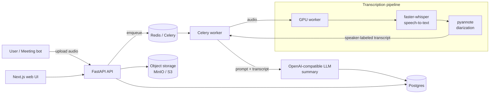

# zabt.ai

**Self-hosted AI meeting intelligence.** zabt.ai transcribes, diarizes, and summarizes
your meetings on infrastructure *you* control — a self-hosted alternative to Otter.ai and
Fireflies where your audio and transcripts never leave your machines. Upload a recording (or
let the bot join a call), and get an accurate, speaker-labeled transcript and an LLM-written
summary, powered by faster-whisper, pyannote, and any OpenAI-compatible model.

[](./LICENSE)

<!-- TODO(human): record 60s demo -->

## Why zabt.ai

- **Your data stays yours.** Audio, transcripts, and summaries live on your own hardware or
  cloud account — nothing is sent to a third-party meeting-notes SaaS.
- **Runs on one machine.** `git clone` → `docker compose up`. Bundled Postgres, object
  storage, transcription worker, and web UI.
- **Bring your own models.** Any OpenAI-compatible LLM endpoint (OpenRouter, Ollama, vLLM,
  LM Studio, OpenAI). Whisper model size is your call.
- **Accurate, speaker-labeled transcripts.** faster-whisper for ASR + pyannote for
  diarization ("who said what").
- **Scales when you need it.** The same codebase runs a single-box deploy or a split
  topology with RunPod serverless GPUs behind a small API VPS.

## Architecture



The GPU worker runs locally by default; in the cloud topology it is a RunPod serverless
endpoint. Authentication is delegated to Supabase (a free project works).

## Quick start (single machine)

**Prerequisites:** Docker + Docker Compose. For GPU transcription: an NVIDIA GPU with the
[NVIDIA Container Toolkit](https://docs.nvidia.com/datacenter/cloud-native/container-toolkit/latest/install-guide.html).
No GPU? See [CPU-only](#cpu-only) below.

```bash
git clone https://github.com/afeef/zabt-ai.git
cd zabt-ai
cp .env.example .env
#   Edit .env and set the 4 REQUIRED values:
#     SUPABASE_URL / SUPABASE_JWT_SECRET / NEXT_PUBLIC_SUPABASE_* (one free Supabase project)
#     OPENAI_API_KEY   (any OpenAI-compatible LLM key)
#     HF_TOKEN         (Hugging Face token — accept the pyannote gate, see below)
docker compose up -d
```

Then open:
- Web UI → http://localhost:3000
- API → http://localhost:8000
- MinIO console → http://localhost:9001

First run downloads the Whisper + pyannote model weights (several GB) into a cached volume.

### CPU-only

No NVIDIA GPU? Run transcription on CPU (slow — use a smaller `WHISPER_MODEL` like `base`):

```bash
docker compose -f docker-compose.yml -f docker-compose.cpu.yml up -d
```

### pyannote Hugging Face gate (required)

Diarization uses gated pyannote models. **The model weights are not shipped with this repo —
you accept the terms and download them yourself:**

1. Create a free account at https://huggingface.co
2. Accept the model conditions on **both**:
   - https://huggingface.co/pyannote/speaker-diarization-3.1
   - https://huggingface.co/pyannote/segmentation-3.0
3. Create a token at https://huggingface.co/settings/tokens and set it as `HF_TOKEN` in `.env`.

## Features

- Audio/video upload → transcription → diarization → LLM summary
- Speaker-labeled, timestamped transcripts with an in-app viewer and editor
- Customizable summary templates
- YouTube URL ingestion
- Microsoft Teams meeting bot (joins and records) *(optional)*
- Visual breakdown of screen-share/video content *(optional, needs Ollama)*
- Server-side PDF export of transcripts and summaries
- Email + Telegram notifications *(optional)*
- Medical transcription mode (MedASR)

## Hardware requirements

Transcription is the demanding part. Approximate GPU VRAM by Whisper model (`WHISPER_MODEL`),
plus ~2-4 GB for pyannote diarization:

| `WHISPER_MODEL` | VRAM (GPU, float16) | Notes |
|-----------------|---------------------|-------|
| `tiny` / `base` | ~1-2 GB | Fast, lower accuracy — good for CPU |
| `small` | ~2-3 GB | |
| `medium` | ~5 GB | |
| `large-v3` (default) | ~10-12 GB | Best accuracy |

- **CPU-only:** works with `int8` compute (automatic) but is roughly 1-5× real-time; prefer
  `base`/`small`.
- **API + workers + DB + Redis + MinIO:** comfortable in ~4 GB RAM / 2 vCPU (excluding the
  GPU worker's model memory).
- **Disk:** budget ~10-15 GB for model weights + your media.

## Deployment topologies

| Topology | Command | Use |
|----------|---------|-----|
| Single machine (default) | `docker compose up -d` | Self-host everything on one box with a local GPU |
| CPU-only | `docker compose -f docker-compose.yml -f docker-compose.cpu.yml up -d` | No GPU available |
| Cloud / RunPod split | `docker compose -f docker-compose.yml -f docker-compose.cloud.yml up -d` | Small API VPS + serverless GPU; managed DB/storage |

See [docs/self-hosting.md](docs/self-hosting.md) and
[docs/advanced-runpod-split.md](docs/advanced-runpod-split.md). Full variable reference:
[docs/configuration.md](docs/configuration.md). Common questions (including AGPL): [docs/faq.md](docs/faq.md).

## Tech stack

Python 3.11 · FastAPI · Celery · SQLModel · faster-whisper (WhisperX) · pyannote-audio ·
Next.js 16 / React 19 · Tailwind CSS 4 · Postgres 16 · Redis 7 · MinIO/S3 · Supabase (auth).

## License & contributing

zabt.ai is licensed under the **GNU AGPL-3.0** (see [LICENSE](./LICENSE) and [NOTICE](./NOTICE)).
In short: you may self-host, modify, and redistribute freely; if you offer a modified version
over a network, you must make your source available to its users.

- **Contributing:** see [CONTRIBUTING.md](./CONTRIBUTING.md). A quick
  [CLA](./CLA.md) signature (handled automatically on your first PR) is required.
- **Using it inside your company is free** and does not trigger any source-sharing obligation —
  see the [FAQ](docs/faq.md).
- **Commercial licensing** (to embed zabt.ai in a proprietary product without AGPL
  obligations): licensing@zabt.ai.
- **Security issues:** please follow [SECURITY.md](./SECURITY.md) — do not open public issues.

"zabt" and "zabt.ai" are trademarks of Afeef Janjua; the AGPL does not grant trademark rights
(see [NOTICE](./NOTICE)).
